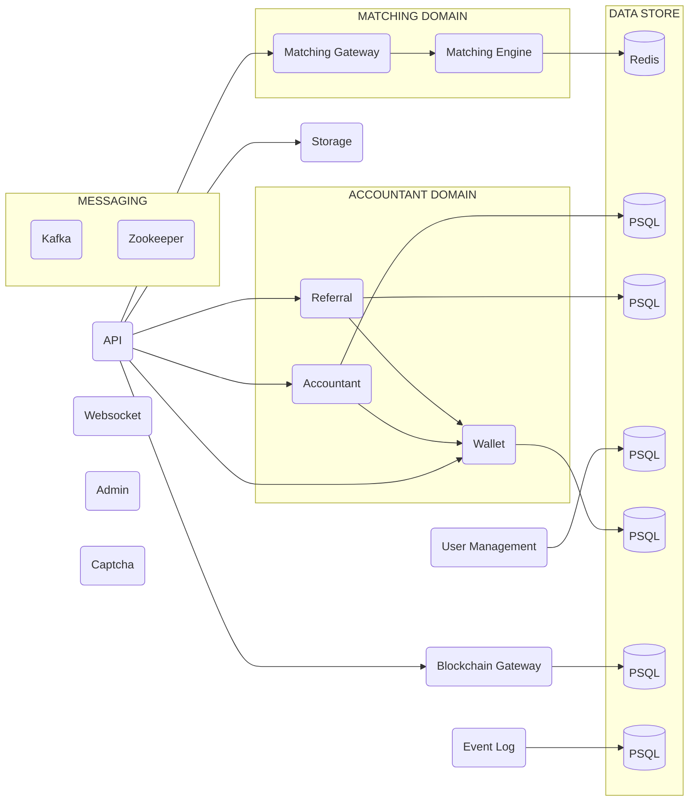

<p align="center">
    <br />
    
    <br />
</p>

<p align="center">
Core is a Kotlin based cryptocurrency exchange and matching engine from the <b>OPEX</b> project. This extendable and
microservice project work as a vanilla core for running cryptocurrency exchanges.
</p>

<p align="center">
    <a href="https://github.com/opexdev/core/blob/main/LICENSE" target="_blank">
        
    </a>
    <a>
        
    </a>
    <a href="https://github.com/opexdev/core/last-commit" target="_blank">
        
    </a>
    <a href="https://github.com/opexdev/core/issues" target="_blank">
        
    </a>
    <a href="https://app.opex.dev" target="_blank">
        
    </a>
</p>

## Contents

- [Build and Run](#build-and-run)
- [Environment Variables](#environment-variables)
- [Live Demo](#live-demo)
- [Architecture Overview](#overview)
- [How to Contribute](#how-to-contribute)
- [License](#license)

## <a name="build-and-run"></a>Build and Run

You need to have [Maven](https://maven.apache.org) and [Docker](https://www.docker.com) installed on your machine.

1. Clone the repository using `git clone https://github.com/opexdev/core.git`
2. `cd` to the cloned directory
3. Create `.env` file in the root directory of the project and add the required [environment variables](#environment-variables).
4. Run `mvn clean install` command to build the project.
5. After successful build, create docker images using `docker compose -f docker-compose.yml -f docker-compose.override.yml -f docker-compose.build.yml -f docker-compose.local.yml up build`.
6. Run the project using `docker compose -f docker-compose.yml -f docker-compose.override.yml -f docker-compose.build.yml -f docker-compose.local.yml up -d`
7. Now run `docker ps` command to see if services are healthy.


## <a name="environment-variables"></a>Environment Variables
```
APP_NAME=Opex-local
APP_BASE_URL=localhost:8080
PANEL_PASS=admin
BACKEND_USER=admin
KEYCLOAK_ADMIN_USERNAME=opex
KEYCLOAK_ADMIN_PASSWORD=hiopex
SMTP_PASS=x
API_KEY_CLIENT_SECRET=x
KEYCLOAK_FRONTEND_URL=http://localhost:8083/auth
KEYCLOAK_ADMIN_URL=http://localhost:8083/auth
KEYCLOAK_VERIFY_REDIRECT_URL=http://localhost:8080/verify
KEYCLOAK_FORGOT_REDIRECT_URL=http://localhost:8080/forgot
PREFERENCES=preferences-demo.yml
WHITELIST_REGISTER_ENABLED=true
WHITELIST_LOGIN_ENABLED=true
WALLET_BACKUP_ENABLED=false
OPEX_ADMIN_KEYCLOAK_CLIENT_SECRET=x
TAG=debug
```
| Variable                                                                                                            | Description                                                                                                                                                                                                                                                                                                                                                                                                                                                                                                                                                    |
|:--------------------------------------------------------------------------------------------------------------------|:---------------------------------------------------------------------------------------------------------------------------------------------------------------------------------------------------------------------------------------------------------------------------------------------------------------------------------------------------------------------------------------------------------------------------------------------------------------------------------------------------------------------------------------------------------------|
| APP_NAME<br/>APP_BASE_URL                                                                                           | Application metadata used by Keycloak                                                                                                                                                                                                                                                                                                                                                                                                                                                                                                                          |
| PANEL_PASS                                                                                                          | Vault's admin panel password                                                                                                                                                                                                                                                                                                                                                                                                                                                                                                                                   |
| BACKEND_USER                                                                                                        | Username used by services to access vault data. Also used as the username of Vault's admin panel                                                                                                                                                                                                                                                                                                                                                                                                                                                               |
| KEYCLOAK_ADMIN_USERNAME                                                                                             | Username for Keycloak's admin panel                                                                                                                                                                                                                                                                                                                                                                                                                                                                                                                            |
| KEYCLOAK_ADMIN_PASSWORD                                                                                             | Password for Keycloak's admin panel                                                                                                                                                                                                                                                                                                                                                                                                                                                                                                                            |
| SMTP_PASS                                                                                                           | SMTP password used by keycloak to send emails for various operations (e.g. user verification, reset password)                                                                                                                                                                                                                                                                                                                                                                                                                                                  |
| API_KEY_CLIENT_SECRET                                                                                               | In order to access the api key feature, please follow the steps below:</br>1. Go to Keycloak's admin panel located at http://localhost:8083/auth/admin/master/console/#/realms/opex/clients <br/>2. Login with the username and password you provided in the `.env` file (KEYCLOAK_ADMIN_USERNAME and KEYCLOAK_ADMIN_PASSWORD)<br/>3. Go to `clients` section in the left menu </br>4. Click on `opex-api-key` client </br>5. In the credentials section, click on `Regenerate Secret` button </br>6. Copy the generated secret and paste it into this section |
| KEYCLOAK_FRONTEND_URL<br/>KEYCLOAK_ADMIN_URL<br/>KEYCLOAK_VERIFY_REDIRECT_URL<br/>KEYCLOAK_FORGOT_REDIRECT_URL      | Replace `localhost` with your server's IP if you're not running on local machine. Do not change the rest.                                                                                                                                                                                                                                                                                                                                                                                                                                                      |
| PREFERENCES                                                                                                         | Points to a file containing seed data used to by modules to initialize their database. An example of this file is provided and is available inside the root directory (preferences-demo.yml). It's deprecated and will be removed soon                                                                                                                                                                                                                                                                                                                         |
| WHITELIST_REGISTER_ENABLED                                                                                          | Allows registration only for whitelisted emails                                                                                                                                                                                                                                                                                                                                                                                                                                                                                                                |
| WHITELIST_LOGIN_ENABLED                                                                                             | Allows login only for whitelisted emails                                                                                                                                                                                                                                                                                                                                                                                                                                                                                                                       |
| WALLET_BACKUP_ENABLED                                                                                               | Enables wallet data backup to google drive folder. In order to use this feature, you need to have `drive-key.json` file (obtained from google's drive API panel) in the root directory of project                                                                                                                                                                                                                                                                                                                                                              |
| OPEX_ADMIN_KEYCLOAK_CLIENT_SECRET                                                                                   | Ignore this for now. Will be removed soon                                                                                                                                                                                                                                                                                                                                                                                                                                                                                                                      |
| Tag                                                                                                                 | Labels locally built docker images                                                                                                                                                                                                                                                                                                                                                                                                                                                                                                                             |

## <a name="live-demo"></a>Live Demo

Deployed at [app.opex.dev](https://app.opex.dev).

## <a name="overview"></a>Architecture Overview



## <a name="how-to-contribute"></a>How to Contribute

We want to make contributing to this project as easy and transparent as possible, and we are grateful to the developer
for contributing bug fixes and improvements.

## <a name="license"></a>License

OPEX is [MIT licensed](https://github.com/opexdev/core/blob/main/LICENSE).
