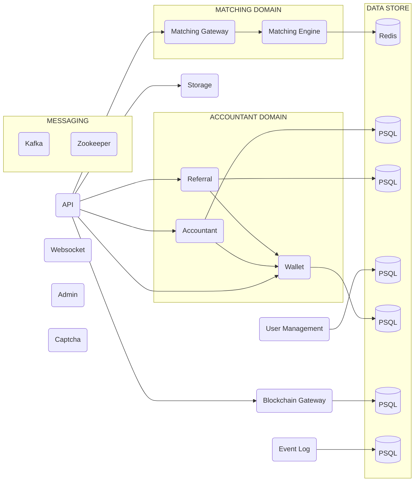

<h1 align="center">
    
</h1>

Core is a Kotlin based cryptocurrency exchange and matching engine from the **OPEX** project. This extendable and
microservice project work as a vanilla core for running cryptocurrency exchanges.

    
    
    
    
    

## Contents

- [Build and Run](#build-and-run)
- [Live Demo](#live-demo)
- [Architecture Overview](#overview)
- [How to Contribute](#how-to-contribute)
- [License](#license)

## Build and Run

You need to have [Maven](https://maven.apache.org) and [Docker](https://www.docker.com) installed.

1. Clone the repository `git clone https://github.com/opexdev/core.git`
1. Run `cd core`
1. Run `mvn clean install` command.
1. Run `docker-compose up --build`.
1. Run `docker ps` to see if every service is running.

## Live Demo

Deployed at [demo.opex.dev](https://demo.opex.dev).

## Architecture Overview

## How to Contribute

We want to make contributing to this project as easy and transparent as possible, and we are grateful to the developer
for contributing bug fixes and improvements.

## License

OPEX is [MIT licensed](https://github.com/opexdev/core/blob/main/LICENSE).
