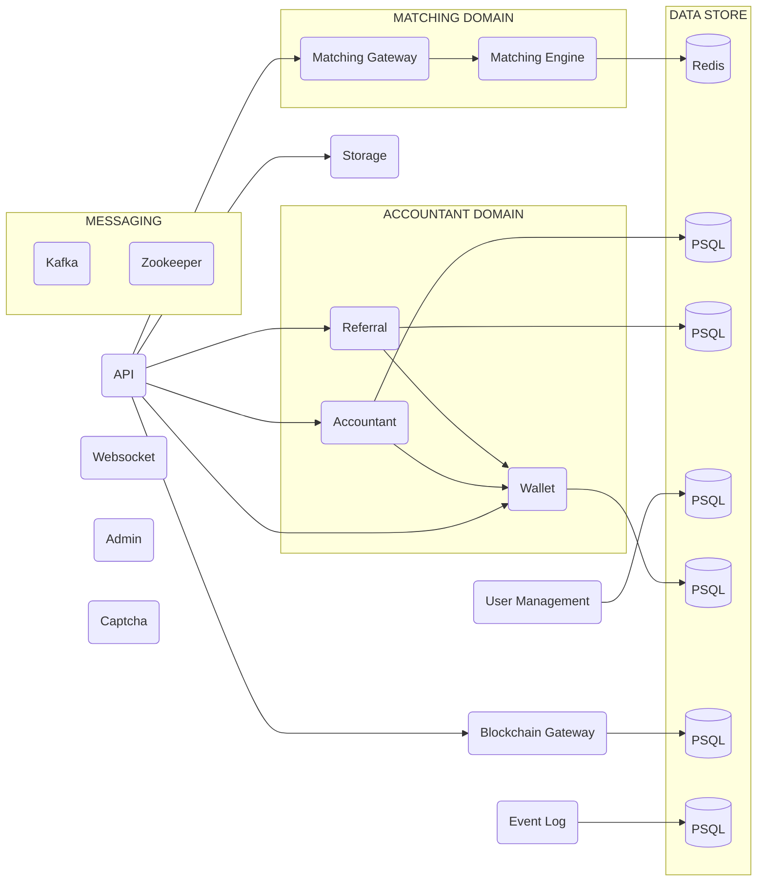

<p align="center">
    <br />
    
    <br />
</p>

<p align="center">
Core is a Kotlin based cryptocurrency exchange and matching engine from the <b>OPEX</b> project. This extendable and
microservice project work as a vanilla core for running cryptocurrency exchanges.
</p>

<p align="center">
    <a href="https://github.com/opexdev/core/blob/main/LICENSE" target="_blank">
        
    </a>
    <a>
        
    </a>
    <a href="https://github.com/opexdev/core/last-commit" target="_blank">
        
    </a>
    <a href="https://github.com/opexdev/core/issues" target="_blank">
        
    </a>
    <a href="https://app.opex.dev" target="_blank">
        
    </a>
</p>

## Contents

- [Build and Run](#build-and-run)
- [Environment Variables](#environment-variables)
- [Live Demo](#live-demo)
- [Architecture Overview](#overview)
- [How to Contribute](#how-to-contribute)
- [License](#license)

## <a name="build-and-run"></a>Build and Run

You need to have [Maven](https://maven.apache.org) and [Docker](https://www.docker.com) installed.

1. Clone the repository `git clone https://github.com/opexdev/core.git`
1. Run `cd core`
1. You will need to create and add the following [Environment Variables](#environment-variables) to the `.env` file located in the root of your project
1. Run `mvn clean install` command.
1. Run `docker compose -f .\docker-compose.yml -f .\docker-compose.override.yml -f .\docker-compose.build.yml -f .\docker-compose.local.yml up -d --build`.
1. Run `docker ps` to see if every service is running.


## <a name="environment-variables"></a>Environment Variables
```
APP_NAME=Opex-local

APP_BASE_URL=localhost:8080

PANEL_PASS=admin

BACKEND_USER=admin

SMTP_PASS=x

OPEX_ADMIN_KEYCLOAK_CLIENT_SECRET=x

API_KEY_CLIENT_SECRET=x

KEYCLOAK_FRONTEND_URL=http://localhost:8083/auth

KEYCLOAK_ADMIN_URL=http://localhost:8083/auth

KEYCLOAK_VERIFY_REDIRECT_URL=http://localhost:8080/verify

KEYCLOAK_FORGOT_REDIRECT_URL=http://localhost:8080/forgot

PREFERENCES=preferences.yml

WHITELIST_REGISTER_ENABLED=true

WHITELIST_LOGIN_ENABLED=true

WALLET_BACKUP_ENABLED=false

TAG=debug
```
| Variable | Description |
| :-------- | :------------------------- |
| SMTP_PASS | An SMTP password is a password used to access an email account's |
| OPEX_ADMIN_KEYCLOAK_CLIENT_SECRET | Ignore this |
| API_KEY_CLIENT_SECRET |(Please do this after starting the project, then rebuild and run the process again.) </br>1. Go to http://localhost:8083/auth/admin/master/console/#/realms/opex/clients </br>2. Click on Opex-api-key </br>3. In the Credentials section, click on Regenerate Secret </br>4. Copy the generated secret and paste it into this section |
| PREFERENCES | For the initialization |

## <a name="live-demo"></a>Live Demo

Deployed at [app.opex.dev](https://app.opex.dev).

## <a name="overview"></a>Architecture Overview



## <a name="how-to-contribute"></a>How to Contribute

We want to make contributing to this project as easy and transparent as possible, and we are grateful to the developer
for contributing bug fixes and improvements.

## <a name="license"></a>License

OPEX is [MIT licensed](https://github.com/opexdev/core/blob/main/LICENSE).
