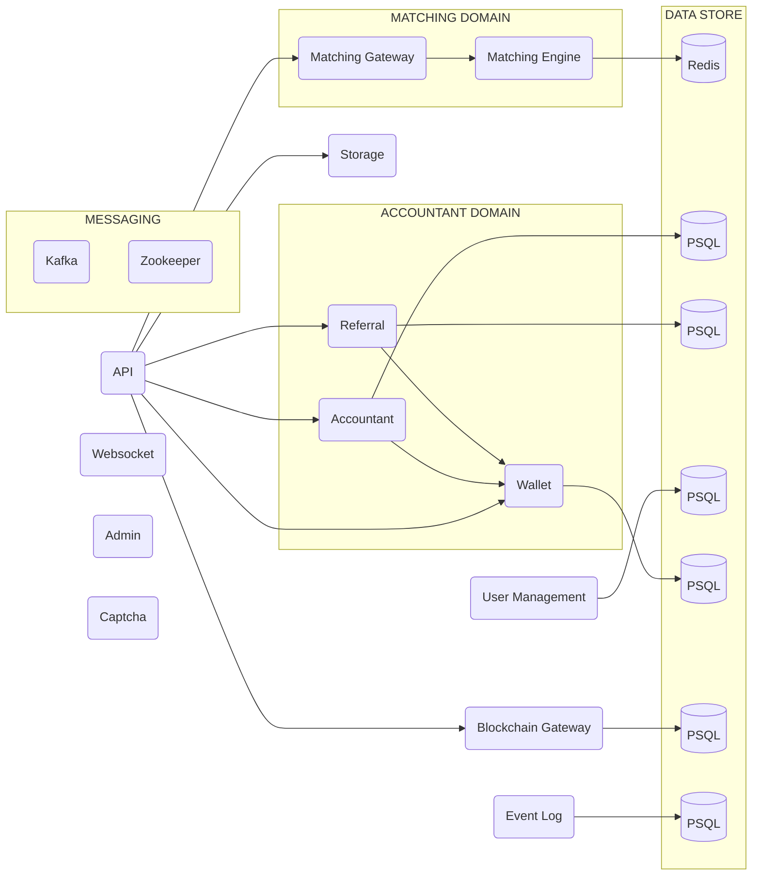

<p align="center">
    <br />
    
    <br />
</p>

<p align="center">
Core is a Kotlin based cryptocurrency exchange and matching engine from the <b>OPEX</b> project. This extendable and
microservice project work as a vanilla core for running cryptocurrency exchanges.
</p>

<p align="center">
    <a href="https://github.com/opexdev/core/blob/main/LICENSE" target="_blank">
        
    </a>
    <a>
        
    </a>
    <a href="https://github.com/opexdev/core/last-commit" target="_blank">
        
    </a>
    <a href="https://github.com/opexdev/core/issues" target="_blank">
        
    </a>
    <a href="https://app.opex.dev" target="_blank">
        
    </a>
</p>

## Contents

- [Build and Run](#build-and-run)
- [Environment Variables](#environment-variables)
- [Live Demo](#live-demo)
- [Architecture Overview](#overview)
- [How to Contribute](#how-to-contribute)
- [License](#license)

## <a name="build-and-run"></a>Build and Run

You need to have [Maven](https://maven.apache.org) and [Docker](https://www.docker.com) installed on your machine.

1. Clone the repository.
2. `cd` to the cloned directory.
3. Create `.env` file in the root directory of the project and add the required [environment variables](#environment-variables).
4. Run `mvn clean install` command to build the project.
5. After successful build, create docker images using `docker compose -f docker-compose.yml -f docker-compose.override.yml -f docker-compose.build.yml -f docker-compose.local.yml build`.
6. Run the project using `docker compose -f docker-compose.yml -f docker-compose.override.yml -f docker-compose.build.yml -f docker-compose.local.yml up -d`.
7. Now run `docker ps` command to see if services are healthy.


## <a name="environment-variables"></a>Environment Variables
```
APP_NAME=Opex
APP_BASE_URL=http://localhost:8094
PANEL_PASS=admin
BACKEND_USER=admin
SMTP_PASS=x
OPEX_ADMIN_KEYCLOAK_CLIENT_SECRET=x
API_KEY_CLIENT_SECRET=x
KEYCLOAK_FRONTEND_URL=http://localhost:8193
KEYCLOAK_ADMIN_URL=http://localhost:8193/
KEYCLOAK_VERIFY_REDIRECT_URL=http://localhost:8080/verify
KEYCLOAK_FORGOT_REDIRECT_URL=http://localhost:8080/forgot
PREFERENCES=preferences.yml
LOGSTASH_ELASTIC_USER=x
LOGSTASH_ELASTIC_PASSWORD=x
KIBANA_ELASTIC_USER=x
KIBANA_ELASTIC_PASSWORD=x
GRAFANA_PASSWORD=x
DRIVE_FOLDER_ID=x
STORAGE_FOLDER_ID=x
WALLET_BACKUP_ENABLED_STORAGE=false
WALLET_BACKUP_ENABLED_GOOGLE_DRIVE=false
WHITELIST_REGISTER_ENABLED=true
WHITELIST_LOGIN_ENABLED=true
VANDAR_API_KEY=x
TAG=debug
KC_DB_USERNAME=admin
KC_DB_PASSWORD=admin
KC_PANEL_USERNAME=admin
KC_PANEL_PASSWORD=admin
DB_USER=opex
DB_PASS=hiopex
SMTP_HOST=x
SMTP_USER=x
SMTP_PASS=x
CLIENT_ID=X
CLIENT_SECRET=X
SMS_PROVIDER_API_KEY=x
KC_GOOGLE_CLIENT_ID=x
KC_GOOGLE_CLIENT_SECRET=***
KC_ADMIN_CLIENT_SECRET=x
KAFKA_CLUSTER_ID=x
JIBIT_API_KEY=x
JIBIT_SECRET_KEY=x
JIBIT_URL=x
WITHDRAW_LIMIT_ENABLED=true
WITHDRAW_OTP_REQUIRED_COUNT=0
WITHDRAW_BANK_ACCOUNT_VALIDATION=false
TRADE_VOLUME_CALCULATION_CURRENCY= USDT
WITHDRAW_VOLUME_CALCULATION_CURRENCY= USDT
TOTAL_ASSET_CALCULATION_CURRENCY= USDT
ADMIN_APPROVAL_PROFILE_COMPLETION_REQUEST=true
MOBILE_IDENTITY_INQUIRY= false
PERSONAL_IDENTITY_INQUIRY= false
ADMIN_APPROVAL_BANK_ACCOUNT=false
KC_PRE_AUTH_CLIENT_SECRET=
KC_ISSUER_URL=http://keycloak:8080/realms/opex
OTP_CODE_RESPONSE_ENABLED=true
CAPTCHA_ENABLED=false
JWK_ENDPOINT=x
SMTP_PROXY_HOST=x
SMTP_PROXY_PORT=x
SMTP_PROXY_ENABLED=false
SWAGGER_API_DOCS_ENABLED="true"
SWAGGER_UI_ENABLED="true"
SWAGGER_AUTH_ENABLED="false"
SWAGGER_AUTH_AUTHORITY="ROLE_admin"
```
| Variable                                    | Description                                                                                                                       |
| :------------------------------------------ | :-------------------------------------------------------------------------------------------------------------------------------- |
| `APP_NAME`                                  | Application name.                                                                                                                 |
| `APP_BASE_URL`                              | Base URL of the application.                                                                                                      |
| `PANEL_PASS`                                | Password for the Vault admin panel.                                                                                               |
| `BACKEND_USER`                              | Username used by backend services to access Vault data and the Vault admin panel.                                                 |
| `SMTP_PASS`                                 | Password used by Keycloak to authenticate with the SMTP server for sending emails such as verification and password reset emails. |
| `OPEX_ADMIN_KEYCLOAK_CLIENT_SECRET`         | Ignore this for now. Will be removed soon.                                                                                        |
| `API_KEY_CLIENT_SECRET`                     | Secret used to access the API key functionality.                                                                                  |
| `KEYCLOAK_FRONTEND_URL`                     | URL used by the frontend to communicate with Keycloak.                                                                            |
| `KEYCLOAK_ADMIN_URL`                        | URL used to access the Keycloak admin panel.                                                                                      |
| `KEYCLOAK_VERIFY_REDIRECT_URL`              | Redirect URL used after successful email verification.                                                                            |
| `KEYCLOAK_FORGOT_REDIRECT_URL`              | Redirect URL used for the forgot-password flow.                                                                                   |
| `PREFERENCES`                               | Path to the application's preferences configuration file.                                                                         |
| `LOGSTASH_ELASTIC_USER`                     | Username used by Logstash to authenticate with Elasticsearch.                                                                     |
| `LOGSTASH_ELASTIC_PASSWORD`                 | Password used by Logstash to authenticate with Elasticsearch.                                                                     |
| `KIBANA_ELASTIC_USER`                       | Username used by Kibana to authenticate with Elasticsearch.                                                                       |
| `KIBANA_ELASTIC_PASSWORD`                   | Password used by Kibana to authenticate with Elasticsearch.                                                                       |
| `GRAFANA_PASSWORD`                          | Password used to access Grafana.                                                                                                  |
| `DRIVE_FOLDER_ID`                           | Google Drive folder ID used for storing backups.                                                                                  |
| `STORAGE_FOLDER_ID`                         | Storage folder ID used for storing backups.                                                                                       |
| `WALLET_BACKUP_ENABLED_STORAGE`             | Enables or disables wallet backup to the configured storage.                                                                      |
| `WALLET_BACKUP_ENABLED_GOOGLE_DRIVE`        | Enables or disables wallet backup to Google Drive.                                                                                |
| `WHITELIST_REGISTER_ENABLED`                | Allows registration only for users whose email addresses are whitelisted.                                                         |
| `WHITELIST_LOGIN_ENABLED`                   | Allows login only for users whose email addresses are whitelisted.                                                                |
| `VANDAR_API_KEY`                            | API key used to authenticate with the Vandar service.                                                                             |
| `TAG`                                       | Tag used for locally built Docker images.                                                                                         |
| `KC_DB_USERNAME`                            | Username used by Keycloak to connect to its database.                                                                             |
| `KC_DB_PASSWORD`                            | Password used by Keycloak to connect to its database.                                                                             |
| `KC_PANEL_USERNAME`                         | Username used to access the Keycloak admin panel.                                                                                 |
| `KC_PANEL_PASSWORD`                         | Password used to access the Keycloak admin panel.                                                                                 |
| `DB_USER`                                   | Username used by the application to connect to the database.                                                                      |
| `DB_PASS`                                   | Password used by the application to connect to the database.                                                                      |
| `SMTP_HOST`                                 | Hostname or IP address of the SMTP server.                                                                                        |
| `SMTP_USER`                                 | Username used to authenticate with the SMTP server.                                                                               |
| `CLIENT_ID`                                 | Client ID used for authentication with the configured external service.                                                           |
| `CLIENT_SECRET`                             | Client secret used together with `CLIENT_ID` for authentication.                                                                  |
| `SMS_PROVIDER_API_KEY`                      | API key used to authenticate with the configured SMS provider.                                                                    |
| `KC_GOOGLE_CLIENT_ID`                       | Google OAuth client ID used by Keycloak for Google authentication.                                                                |
| `KC_GOOGLE_CLIENT_SECRET`                   | Google OAuth client secret used by Keycloak for Google authentication.                                                            |
| `KC_ADMIN_CLIENT_SECRET`                    | Client secret used to authenticate with the Keycloak admin API.                                                                   |
| `KAFKA_CLUSTER_ID`                          | Identifier of the Kafka cluster used by the application.                                                                          |
| `JIBIT_API_KEY`                             | API key used to authenticate with the Jibit service.                                                                              |
| `JIBIT_SECRET_KEY`                          | Secret key used together with the Jibit API key for Jibit authentication.                                                         |
| `JIBIT_URL`                                 | Base URL of the Jibit API.                                                                                                        |
| `WITHDRAW_LIMIT_ENABLED`                    | Enables or disables withdrawal limits.                                                                                            |
| `WITHDRAW_OTP_REQUIRED_COUNT`               | Number of withdrawal requests after which OTP verification is required.                                                           |
| `WITHDRAW_BANK_ACCOUNT_VALIDATION`          | Enables or disables bank account validation during withdrawals.                                                                   |
| `TRADE_VOLUME_CALCULATION_CURRENCY`         | Currency used to calculate trading volume.                                                                                        |
| `WITHDRAW_VOLUME_CALCULATION_CURRENCY`      | Currency used to calculate withdrawal volume.                                                                                     |
| `TOTAL_ASSET_CALCULATION_CURRENCY`          | Currency used to calculate the total value of user assets.                                                                        |
| `ADMIN_APPROVAL_PROFILE_COMPLETION_REQUEST` | Determines whether profile completion requests require admin approval.                                                            |
| `MOBILE_IDENTITY_INQUIRY`                   | Enables or disables mobile identity verification.                                                                                 |
| `PERSONAL_IDENTITY_INQUIRY`                 | Enables or disables personal identity verification.                                                                               |
| `ADMIN_APPROVAL_BANK_ACCOUNT`               | Determines whether adding or updating a bank account requires admin approval.                                                     |
| `KC_PRE_AUTH_CLIENT_SECRET`                 | Client secret used by the Keycloak pre-authentication client.                                                                     |
| `KC_ISSUER_URL`                             | Internal Keycloak issuer URL used by backend services for authentication and token validation.                                    |
| `OTP_CODE_RESPONSE_ENABLED`                 | Enables or disables returning the OTP code in the API response.                                                                   |
| `CAPTCHA_ENABLED`                           | Enables or disables CAPTCHA validation.                                                                                           |
| `JWK_ENDPOINT`                              | Endpoint used to retrieve JSON Web Keys (JWKs) for JWT validation.                                                                |
| `SMTP_PROXY_HOST`                           | Hostname or IP address of the SMTP proxy.                                                                                         |
| `SMTP_PROXY_PORT`                           | Port of the SMTP proxy.                                                                                                           |
| `SMTP_PROXY_ENABLED`                        | Enables or disables the SMTP proxy.                                                                                               |
| `SWAGGER_API_DOCS_ENABLED`                  | Enables or disables Swagger/OpenAPI API documentation.                                                                            |
| `SWAGGER_UI_ENABLED`                        | Enables or disables the Swagger UI.                                                                                               |
| `SWAGGER_AUTH_ENABLED`                      | Enables or disables authentication for Swagger UI.                                                                                |
| `SWAGGER_AUTH_AUTHORITY`                    | Required authority/role for accessing Swagger UI when authentication is enabled.                                                  |


## <a name="live-demo"></a>Live Demo

Deployed at [beta.opex.dev](https://beta.opex.dev).

## <a name="overview"></a>Architecture Overview


```mermaid
    graph LR
        USER_MANAGMENT(User Management)
        KAFKA(Kafka)
        ZOOKEEPER(Zookeeper)
        REDIS[(Redis)]
        ACCOUNTANT_POSTGRESQL[(PSQL)]
        REFERRAL_POSTGRESQL[(PSQL)]
        USER_MANAGMENT_POSTGRESQL[(PSQL)]
        WALLET_POSTGRESQL[(PSQL)]
        BC_GATEWAY_POSTGRESQL[(PSQL)]
        EVENTLOG_POSTGRESQL[(PSQL)]
        ACCOUNTANT(Accountant)
        API(API)
        WALLET(Wallet)
        MATCHING_ENGINE(Matching Engine)
        MATCHING_GATEWAY(Matching Gateway)
        REFERRAL(Referral)
        STORAGE(Storage)
        BC_GATEWAY(Blockchain Gateway)
        WEBSOCKET(Websocket)
        ADMIN(Admin)
        CAPTCHA(Captcha)
        EVENTLOG(Event Log)
                
        API-->MATCHING_GATEWAY
        API-->WALLET
        API-->REFERRAL
        API-->STORAGE
        API-->BC_GATEWAY
        API-->ACCOUNTANT
        
        MATCHING_ENGINE-->REDIS
        USER_MANAGMENT-->USER_MANAGMENT_POSTGRESQL
        BC_GATEWAY-->BC_GATEWAY_POSTGRESQL
        REFERRAL-->REFERRAL_POSTGRESQL
        WALLET-->WALLET_POSTGRESQL
        ACCOUNTANT-->ACCOUNTANT_POSTGRESQL
        EVENTLOG-->EVENTLOG_POSTGRESQL
        
        subgraph MESSAGING
            KAFKA
            ZOOKEEPER
        end
        
        subgraph MATCHING DOMAIN
            MATCHING_GATEWAY-->MATCHING_ENGINE
        end
        
        subgraph ACCOUNTANT DOMAIN
            ACCOUNTANT-->WALLET
            REFERRAL-->WALLET
        end
        
        subgraph DATA STORE
            BC_GATEWAY_POSTGRESQL
            REFERRAL_POSTGRESQL
            ACCOUNTANT_POSTGRESQL
            WALLET_POSTGRESQL
            USER_MANAGMENT_POSTGRESQL
            EVENTLOG_POSTGRESQL
            REDIS
        end
```

## <a name="how-to-contribute"></a>How to Contribute

We want to make contributing to this project as easy and transparent as possible, and we are grateful to the developer
for contributing bug fixes and improvements.

## <a name="license"></a>License

OPEX is [MIT licensed](https://github.com/opexdev/core/blob/main/LICENSE).
